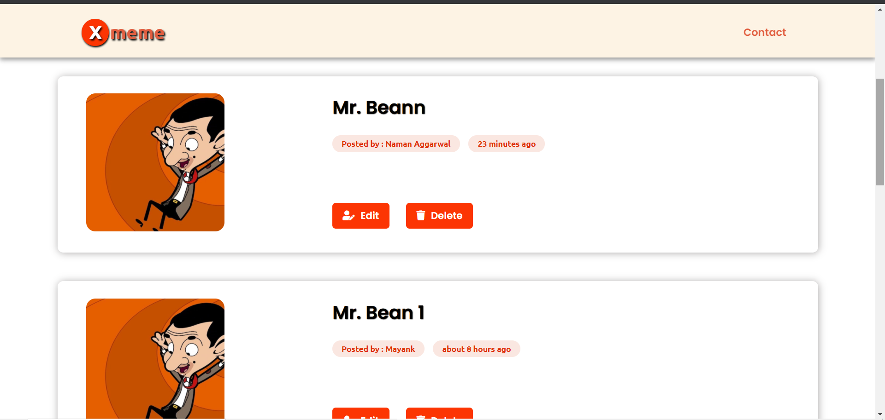
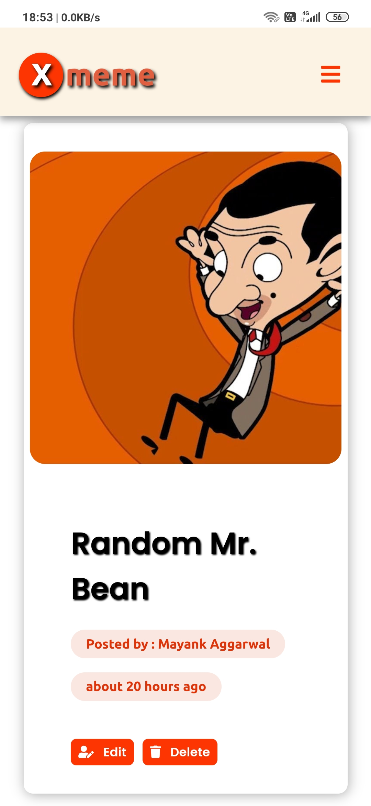

# 💻 X-MEME APPLICATION front-end
[](https://www.w3schools.com/html)
[](https://www.w3schools.com/css)
[](https://www.w3schools.com/js)
[](https://github.com/mayank-aggrwal/)
[](https://choosealicense.com/licenses/mit/)

LIVE @ : https://mayank-aggrwal.github.io/x-meme/

A full stack application to share hilarious memes.
  
Fully responsive website (for posting memes) using only HTML, CSS and JS

### API (Backend)
https://damp-ridge-18897.herokuapp.com/

GIT REPO : https://github.com/mayank-aggrwal/proj-c

<br>

### Frontend
https://mayank-aggrwal.github.io/x-meme/

<br>

## Sreenshots
  
### Desktop

  
  
### Mobile

  

## Features

1. Post meme images along with your name and caption
2. Edit posted memes
3. Deleting memes

## Instructions

 - Clone the repository
 - Open index.html to view webpage
 
## Additional helpful commands

### Touch alternative in windows powershell :
```bash
$null > file_name.cpp
```

### Configure GIT :
```bash
git config --global user.email "user_mail"
git config --global user.name "user_name"
```

###### NOTE: Make .gitignore file after initialising the GIT repository
<br>

### To checkout a particular branch:
```bash
git checkout <branch-name>
```

### To list all the branches in the git repository:
```bash
git branch -a
```

### To merge a branch into master branch:
> Change to master branch
```bash
git checkout master
git merge <branch-name>
```

### To see git branch graphs in terminal:
```bash
git log --graph --oneline --decorate --all
```

### To see all remotes
```bash
git remote -v
```

### To push all branches to remote repository
```bash
git push --all <remote-origin>
```

### To add a new remote to push changes to
```bash
git remote add new-remote-origin-name https://github.com/user_name/repo.git
```

## Contributing

Pull requests are welcome. For major changes, please open an issue first to discuss what you would like to change.
Check Contributing.md for more instructions.

## License

[MIT](https://choosealicense.com/licenses/mit/)
